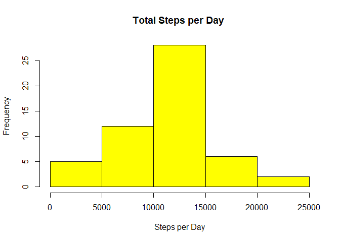
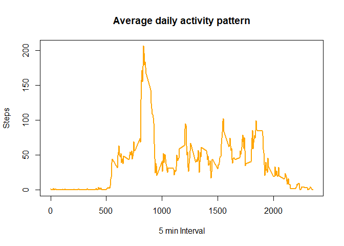
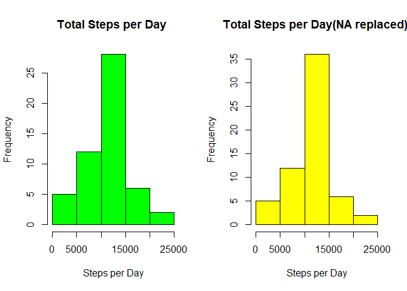
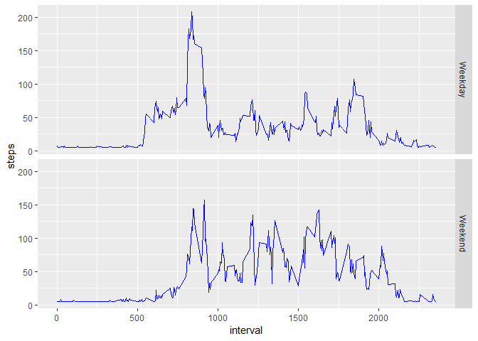

```r
knitr::opts_chunk$set(echo = TRUE)
library(dplyr)
```

```
## 
## Attaching package: 'dplyr'
```

```
## The following objects are masked from 'package:stats':
## 
##     filter, lag
```

```
## The following objects are masked from 'package:base':
## 
##     intersect, setdiff, setequal, union
```

```r
library(ggplot2) 
```
Reading the data frame from the internet link, downloadig and unzipping the file

```r
tempo <- tempfile()
download.file("https://d396qusza40orc.cloudfront.net/repdata%2Fdata%2Factivity.zip",tempo)
activity<- read.csv(unz(tempo, "activity.csv"))
unlink(tempo)

a<-filter(activity,!is.na(activity$steps)==TRUE) #deleting NA
a<-mutate (a , date = as.Date ( date )) #to have the format on dates
```
Total of steps per day

```r
b<-tapply(a$steps , a$date, sum)# sum per day but I have an array
hist(b,col = "yellow" ,xlab = "Steps per Day",main = "Total Steps per Day " )
```

<!-- -->

```r
# STEPS MEAN AND MEDIAN of the total
b<-as.vector(b)
b<-b[!is.na(b)]
m1<-mean(b)
m2<-median(b)
```
Mean of the total of steps

```r
m1
```

```
## [1] 10766.19
```
Median of the total of steps

```r
m2 
```

```
## [1] 10765
```
Average daily activity pattern

```r
c<-group_by(a,interval)%>%summarize(steps=mean(steps))

plot(c$interval,c$steps, type = "l",lwd=2,col="orange",xlab = "5 min Interval",ylab="Steps",main="Average daily activity pattern")
```

<!-- -->

Maximun number of steps in an interval

```r
c1<-max(c$steps)
c2<-c$interval[which(c$steps==max(c1))]
c1 # Maximun number of steps
```

```
## [1] 206.1698
```

```r
c2 #interval for maximun number of steps
```

```
## [1] 835
```
 Total number of missing values

```r
a1<-filter(activity,is.na(activity$steps)==TRUE)
a1<-nrow(a1) #number of rows with NA
a1   #  Total number of missing values
```

```
## [1] 2304
```
Replacing the NA in the steps variable with the mean of steps of the data set


```r
a2<-activity
a2[is.na(a2)]<-mean(a$steps)

a2<-mutate (a2 , date = as.Date ( date )) # a2 is the new data set replacing the NA values
head(a2)
```

```
##     steps       date interval
## 1 37.3826 2012-10-01        0
## 2 37.3826 2012-10-01        5
## 3 37.3826 2012-10-01       10
## 4 37.3826 2012-10-01       15
## 5 37.3826 2012-10-01       20
## 6 37.3826 2012-10-01       25
```

```r
b2<-tapply(a2$steps , a2$date, sum)

par(mfrow=c(1,2))
hist(b,col = "green" ,xlab = "Steps per Day",main = "Total Steps per Day " )
hist(b2,col = "yellow" ,xlab = "Steps per Day",main = "Total Steps per Day(NA replaced) " )
```

<!-- -->
median and mean in the new data set

```r
b2<-as.vector(b2)
m3<-mean(b2)
m4<-median(b2)
```
Mean (replacing NA values)

```r
m3 
```

```
## [1] 10766.19
```
Mean (replacing NA values)

```r
m4
```

```
## [1] 10766.19
```

```r
#mean is the same, the median is very close to the original value and now equal to mean
```

New factor variable in the dataset with two levels - "weekday" and "weekend"

```r
c4a<-ifelse (weekdays(as.Date(a2$date))=="Saturday"|weekdays(as.Date(a2$date))=="Sunday","Weekend","Weekday")
# creating a factor variable
c4a<-factor(c4a)
a2a<-mutate (a2 , week = c4a)
```
5-minute interval and the average number of steps taken, averaged across all weekday days or weekend days

```r
c6 <- aggregate(steps ~ interval + week, data = a2a, FUN = mean)
d<-ggplot(c6,aes(x=interval,y=steps))
d1<-d+geom_line(color="blue")+facet_grid(week~.)
d1
```

<!-- -->

## R Markdown

This is an R Markdown document. Markdown is a simple formatting syntax for authoring HTML, PDF, and MS Word documents. For more details on using R Markdown see <http://rmarkdown.rstudio.com>.

When you click the **Knit** button a document will be generated that includes both content as well as the output of any embedded R code chunks within the document. You can embed an R code chunk like this:

